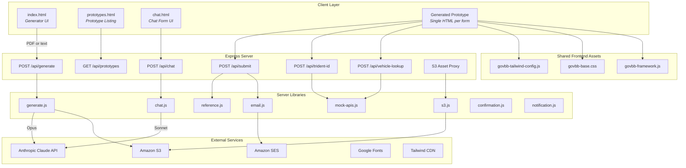

# GovTech Barbados – Architecture Overview

## System Summary

This is a **form prototype generator and runtime platform** for the Government of Barbados. It takes PDF form specifications as input, uses Claude AI to generate clickable multi-page HTML prototypes that follow the alpha.gov.bb design system, and provides a complete submission pipeline with email notifications. Users can also fill forms via a conversational chat interface.

---

## Architecture Diagram



---

## Layer-by-Layer Breakdown

### 1. Client Layer

Four distinct entry points serve different user roles:

| Page | File | Purpose |
|---|---|---|
| Generator UI | `public/index.html` | Upload a PDF form spec or paste text; triggers Claude to produce a prototype |
| Prototype listing | `public/prototypes.html` | Browse all generated prototypes stored in S3 |
| Chat form UI | `public/chat.html` | Conversational alternative – citizens answer questions via chat instead of navigating form pages |
| Generated prototype | `prototypes/*.html` | The clickable multi-page HTML form itself, loaded from S3 at runtime |

### 2. Shared Frontend Assets (`public/assets/`)

Every generated prototype loads three shared files. These are **never inlined** – they're served from S3 via the Express proxy.

| File | Size | Role |
|---|---|---|
| `govbb-tailwind-config.js` | Tailwind theme | Extends Tailwind with `bb-` prefixed colour tokens (e.g. `bg-bb-yellow-100`), spacing scale, typography, and border radius tokens matching the alpha.gov.bb design system |
| `govbb-base.css` | CSS foundation | Defines CSS custom properties (`:root` variables), body grid layout (header → alpha banner → main → footer), `.container` max-width, and `.sr-only` utility |
| `govbb-framework.js` | ~850 lines | The core runtime: page navigation via URL hash, template helper functions (text fields, radio groups, date inputs, etc.), client-side validation with error summaries, form data store (`GovBB.D`), and automatic form submission before the confirmation page |

### 3. Express Server (`server.js`)

Single Node.js process running on port 3000. Key behaviours:

- **Static serving** of `public/` directory
- **S3 proxy** for shared assets (`GET /assets/:file`) and generated prototypes (`GET /:name.html`) – avoids exposing S3 URLs directly
- **Asset sync on startup** – uploads the three shared asset files to S3 with 1-hour cache headers
- **PDF upload** via multer (max 10 MB)
- **Long timeouts** on the generate endpoint (15 minutes) to accommodate Claude API streaming

### 4. API Endpoints

| Endpoint | Method | Library | External service | Purpose |
|---|---|---|---|---|
| `/api/generate` | POST | `generate.js` | Claude API (Opus) | Accept PDF/text spec → stream Claude completion → extract HTML → upload to S3 → return URL |
| `/api/submit` | POST | `reference.js`, `email.js` | Amazon SES | Accept form data → generate reference number → send confirmation + MDA notification emails |
| `/api/chat` | POST | `chat.js` | Claude API (Sonnet) | Multi-turn conversational form-filling with tool use (`save_fields`, `complete_form`) |
| `/api/trident-id` | POST | `mock-apis.js` | – | Mock citizen identity lookup by National Registration Number (4 test records) |
| `/api/vehicle-lookup` | POST | `mock-apis.js` | – | Mock vehicle details lookup by licence plate (4 test records) |
| `/api/prototypes` | GET | `s3.js` | Amazon S3 | List all generated prototype files from the S3 bucket |

### 5. Server Libraries (`lib/`)

| Module | Responsibility |
|---|---|
| `generate.js` | Calls Claude Opus with the 59 KB CLAUDE.md system prompt. Streams the response and auto-continues if output is truncated at the token limit. Stitches multi-part responses and uploads the final HTML to S3. |
| `reference.js` | Generates unique reference numbers in the format `PREFIX-YEAR-XXXX`. Maintains a mapping of known form names to prefixes (e.g. "Vehicle Registration" → `VR`). Falls back to generating initials from the form name. |
| `email.js` | Sends transactional emails via Amazon SES. Uses two HTML templates with full government branding (blue top bar, yellow header, teal accents). |
| `chat.js` | Orchestrates multi-turn conversations with Claude Sonnet. Stores conversation state in memory with a 1-hour TTL. Exposes two tools to the model: `save_fields` (stores user answers) and `complete_form` (triggers submission). |
| `mock-apis.js` | Provides hardcoded test data for the Trident ID and vehicle lookup endpoints with simulated 500–1000 ms latency. |
| `s3.js` | Thin wrapper around `@aws-sdk/client-s3` for uploading, listing, and reading objects. |
| `templates/confirmation.js` | HTML email template sent to the applicant with their reference number. |
| `templates/notification.js` | HTML email template sent to the MDA admin inbox with a table of all submitted form data. |

### 6. External Services

| Service | Usage |
|---|---|
| **Anthropic Claude API** | Two models: Opus for prototype generation (high quality, long output), Sonnet for chat (faster, conversational) |
| **Amazon S3** | Stores generated HTML prototypes and shared frontend assets. Bucket name configured via `S3_BUCKET` env var. |
| **Amazon SES** | Sends confirmation and notification emails. Sender address configured via `FROM_EMAIL` env var. |
| **Google Fonts** | Serves the Figtree typeface used across all prototypes |
| **Tailwind CDN** | Provides the Tailwind CSS runtime, extended by the custom config |

---

## Key Data Flows

### Prototype Generation

```
Designer uploads PDF spec
  → multer parses upload
  → pdf-parse extracts text
  → Claude Opus streams HTML (using CLAUDE.md as system prompt)
  → Auto-continues if truncated at 32K tokens
  → HTML uploaded to S3
  → URL returned to Generator UI
```

### Form Submission

```
Citizen fills form in prototype
  → Clicks "Submit application" on Check Your Answers page
  → GovBB.next() detects next page is confirmation
  → POST /api/submit { formName, formData, userEmail }
  → Server generates reference (PREFIX-YEAR-XXXX)
  → Sends confirmation email to citizen (parallel)
  → Sends notification email to MDA admin (parallel)
  → Returns { referenceNumber } to client
  → Confirmation page displays reference
```

### Conversational Form-Filling

```
Citizen opens chat.html?form=vehicle-registration
  → Client fetches form HTML, extracts <script> block
  → POST /api/chat { message, formScript }
  → Claude Sonnet asks questions one at a time
  → Calls save_fields tool as answers are given
  → On completion, calls complete_form tool
  → Server triggers /api/submit internally
  → Returns reference number to chat UI
```

---

## Dependencies

| Package | Version | Purpose |
|---|---|---|
| `express` | ^4.21.0 | Web server framework |
| `@anthropic-ai/sdk` | ^0.39.0 | Claude API client |
| `@aws-sdk/client-s3` | ^3.1009.0 | S3 object storage |
| `@aws-sdk/client-ses` | ^3.1009.0 | Transactional email |
| `multer` | ^1.4.5-lts.1 | Multipart file upload handling |
| `pdf-parse` | ^1.1.1 | PDF text extraction |
| `dotenv` | ^16.4.0 | Environment variable loading |

---

## Configuration

All secrets and environment-specific values are stored in `.env`:

| Variable | Purpose |
|---|---|
| `AWS_REGION` | AWS region (e.g. `us-east-1`) |
| `AWS_ACCESS_KEY_ID` | AWS IAM credentials |
| `AWS_SECRET_ACCESS_KEY` | AWS IAM credentials |
| `S3_BUCKET` | S3 bucket for prototypes and assets |
| `FROM_EMAIL` | SES-verified sender address |
| `MDA_EMAIL` | Admin inbox for submission notifications |
| `ANTHROPIC_API_KEY` | Claude API key |
| `PORT` | Server port (default 3000) |
